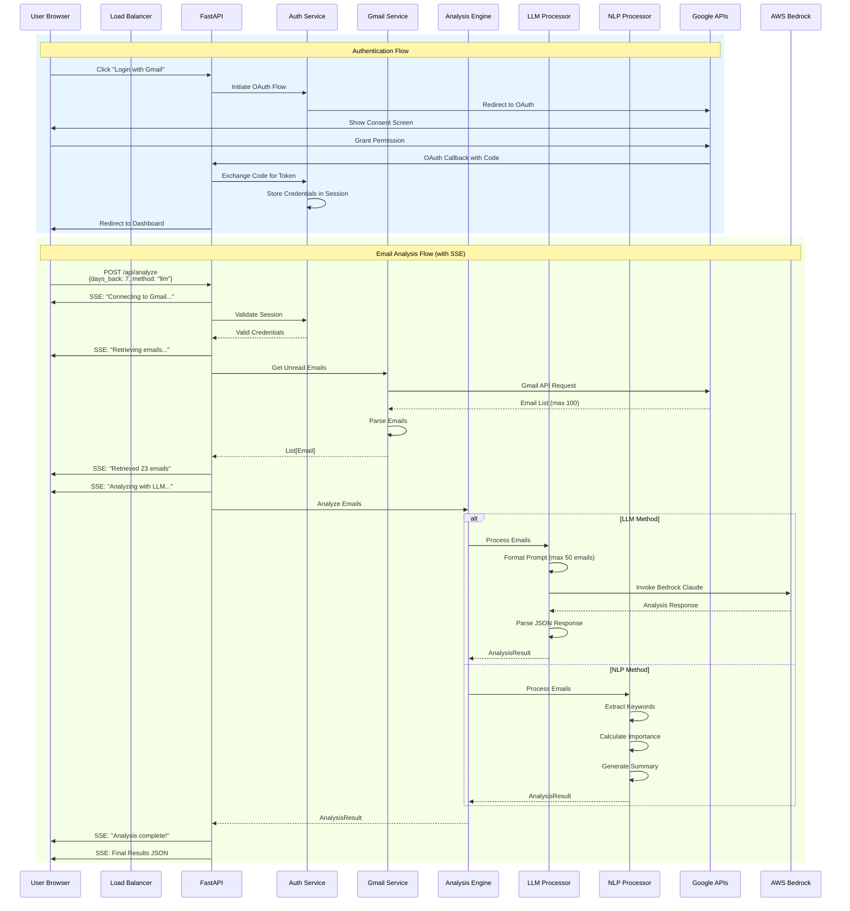
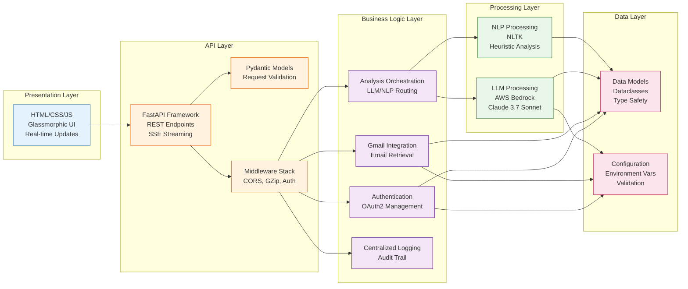
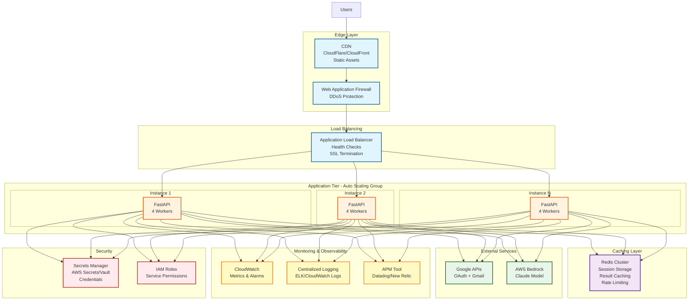
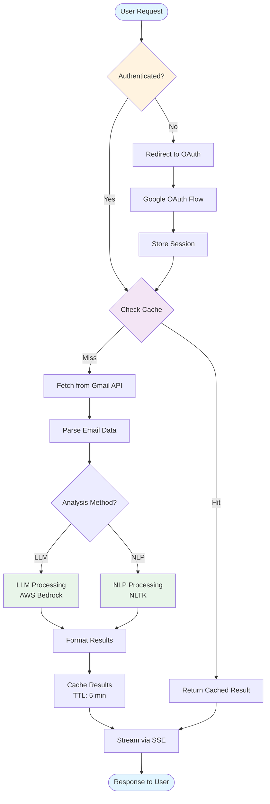
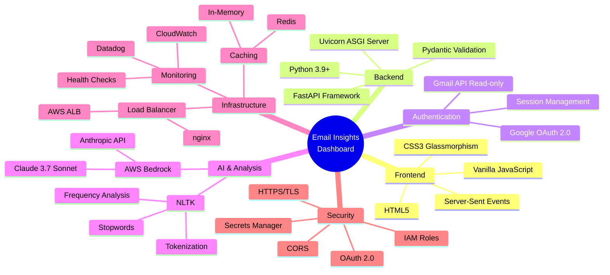
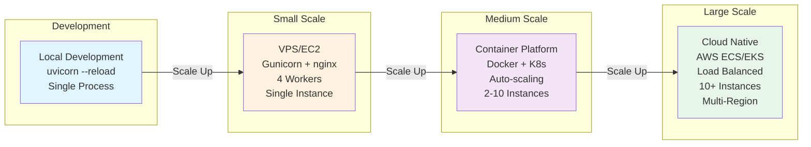

# Email Insights Dashboard - Architecture

## System Architecture Diagram

```mermaid
graph TB
    subgraph "Client Layer"
        Browser[Web Browser]
        Mobile[Mobile Browser]
    end

    subgraph "Load Balancer Layer (Production)"
        LB[Load Balancer<br/>nginx/ALB/CloudFlare]
    end

    subgraph "Application Layer"
        subgraph "FastAPI Instances"
            API1[FastAPI Instance 1<br/>Uvicorn Worker]
            API2[FastAPI Instance 2<br/>Uvicorn Worker]
            API3[FastAPI Instance N<br/>Uvicorn Worker]
        end
        
        subgraph "API Components"
            Routes[API Routes<br/>main.py]
            Middleware[Middleware<br/>CORS, GZip, Auth]
            SSE[Server-Sent Events<br/>Real-time Progress]
        end
    end

    subgraph "Service Layer"
        AuthService[Authentication Service<br/>OAuth2 Flow Management]
        GmailService[Gmail Service<br/>Email Retrieval & Parsing]
        AnalysisEngine[Analysis Engine<br/>Route to LLM/NLP]
        LoggingService[Logging Service<br/>Structured Logging]
        
        subgraph "Analysis Processors"
            LLMProcessor[LLM Processor<br/>AWS Bedrock Claude]
            NLPProcessor[NLP Processor<br/>NLTK Analysis]
        end
    end

    subgraph "Data Layer"
        Models[Data Models<br/>Email, AnalysisResult<br/>ImportantEmail]
        Config[Configuration<br/>Environment Variables<br/>Credentials]
    end

    subgraph "Session Storage (Production)"
        SessionStore[Session Store<br/>Redis/Memcached<br/>In-Memory Default]
    end

    subgraph "External Services"
        subgraph "Google Cloud"
            GoogleOAuth[Google OAuth 2.0<br/>Authentication]
            GmailAPI[Gmail API<br/>Read-only Access]
        end
        
        subgraph "AWS Services"
            Bedrock[AWS Bedrock<br/>Claude 3.7 Sonnet]
            IAM[AWS IAM<br/>Credentials & Permissions]
        end
    end

    subgraph "Monitoring & Logging (Production)"
        Logs[Log Files<br/>app.log, access.log]
        Metrics[Metrics<br/>CloudWatch/Datadog]
        Health[Health Check<br/>/health endpoint]
    end

    subgraph "Caching Layer (Production)"
        Cache[Redis Cache<br/>Analysis Results<br/>Session Data]
    end

    %% Client connections
    Browser --> LB
    Mobile --> LB
    
    %% Load balancer to API instances
    LB --> API1
    LB --> API2
    LB --> API3
    
    %% API to components
    API1 --> Routes
    API2 --> Routes
    API3 --> Routes
    Routes --> Middleware
    Middleware --> SSE
    
    %% Routes to services
    Routes --> AuthService
    Routes --> GmailService
    Routes --> AnalysisEngine
    Routes --> LoggingService
    
    %% Analysis engine routing
    AnalysisEngine --> LLMProcessor
    AnalysisEngine --> NLPProcessor
    
    %% Services to external APIs
    AuthService --> GoogleOAuth
    GmailService --> GmailAPI
    LLMProcessor --> Bedrock
    LLMProcessor --> IAM
    
    %% Services to data layer
    AuthService --> Models
    GmailService --> Models
    AnalysisEngine --> Models
    LLMProcessor --> Models
    NLPProcessor --> Models
    
    %% Configuration
    AuthService --> Config
    GmailService --> Config
    LLMProcessor --> Config
    
    %% Session management
    AuthService --> SessionStore
    Routes --> SessionStore
    
    %% Caching
    AnalysisEngine -.-> Cache
    GmailService -.-> Cache
    
    %% Monitoring
    Routes --> Logs
    LoggingService --> Logs
    Routes --> Health
    API1 --> Metrics
    API2 --> Metrics
    API3 --> Metrics
    
    %% Styling
    classDef client fill:#e1f5ff,stroke:#01579b,stroke-width:2px
    classDef api fill:#fff3e0,stroke:#e65100,stroke-width:2px
    classDef service fill:#f3e5f5,stroke:#4a148c,stroke-width:2px
    classDef external fill:#e8f5e9,stroke:#1b5e20,stroke-width:2px
    classDef data fill:#fce4ec,stroke:#880e4f,stroke-width:2px
    classDef infra fill:#fff9c4,stroke:#f57f17,stroke-width:2px
    
    class Browser,Mobile client
    class API1,API2,API3,Routes,Middleware,SSE api
    class AuthService,GmailService,AnalysisEngine,LLMProcessor,NLPProcessor,LoggingService service
    class GoogleOAuth,GmailAPI,Bedrock,IAM external
    class Models,Config,SessionStore data
    class LB,Cache,Logs,Metrics,Health infra
```

## Data Flow Diagram

## Component Architecture

## Scaling Architecture (Production)

## Request Flow with Caching

## Technology Stack

## Deployment Options

## Key Architecture Decisions

### 1. **Layered Architecture**
- Clear separation of concerns
- Easy to test and maintain
- Scalable and modular

### 2. **Service Pattern**
- Each service has single responsibility
- Dependency injection for testability
- Loose coupling between components

### 3. **Real-time Communication**
- Server-Sent Events for progress updates
- Non-blocking async processing
- Better user experience

### 4. **Stateless Application**
- Sessions stored externally (Redis in production)
- Horizontal scaling friendly
- Load balancer compatible

### 5. **External Service Integration**
- Google OAuth for authentication
- Gmail API for email access
- AWS Bedrock for AI processing
- Graceful error handling

### 6. **Performance Optimizations**
- GZip compression
- Email limits (100 Gmail, 50 LLM)
- Token optimization (2048 max)
- Connection pooling
- Result caching (production)

### 7. **Security**
- OAuth 2.0 authentication
- Read-only Gmail access
- HTTPS in production
- Secrets management
- IAM role-based access

### 8. **Observability**
- Structured logging
- Health check endpoints
- Metrics collection
- Error tracking
- Audit trail
