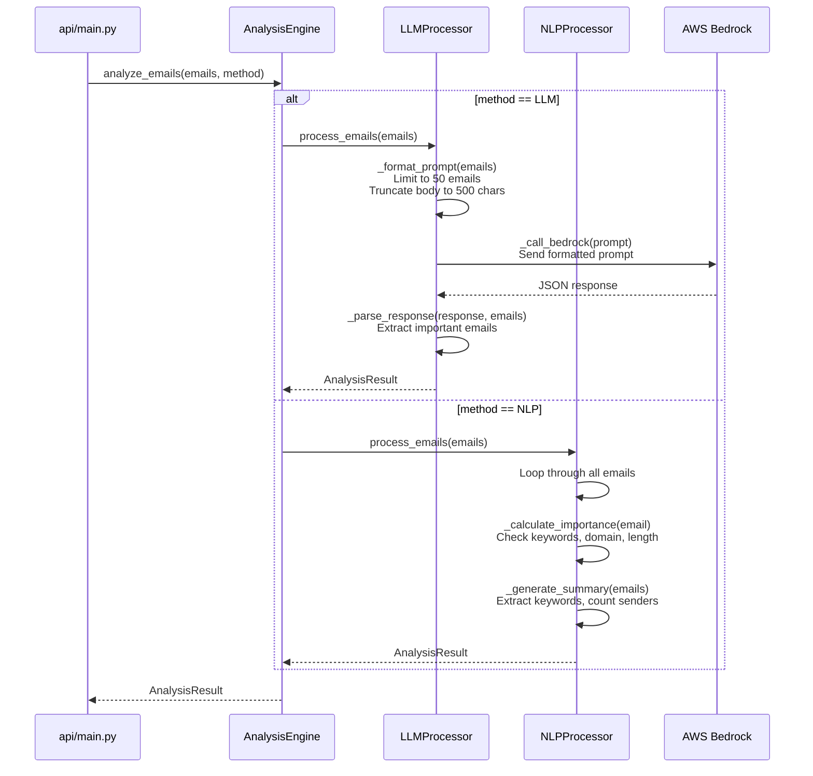

# Email Processing Flow - Where Emails Go to LLM/NLP

## Complete Flow Diagram



## Detailed Function Breakdown

### 1️⃣ **Entry Point: `api/main.py` (Line ~430)**

```python
# In generate_progress() function
result = analysis_engine.analyze_emails(emails, analysis_method)
```

**What happens:**
- Receives `List[Email]` from Gmail service
- Receives `analysis_method` (LLM or NLP) from user selection
- Calls AnalysisEngine to route to appropriate processor

---

### 2️⃣ **Router: `services/analysis_engine.py`**

```python
def analyze_emails(self, emails: List[Email], method: AnalysisMethod) -> AnalysisResult:
    if method == AnalysisMethod.LLM:
        return self.llm_processor.process_emails(emails)  # ← Routes to LLM
    elif method == AnalysisMethod.NLP:
        return self.nlp_processor.process_emails(emails)  # ← Routes to NLP
```

**What happens:**
- Checks which method user selected
- Routes to appropriate processor
- Returns unified `AnalysisResult`

---

### 3️⃣A **LLM Path: `services/llm_processor.py`**

#### **Main Function: `process_emails()`** (Line 69)

```python
def process_emails(self, emails: List[Email]) -> AnalysisResult:
    # 1. Format emails into prompt
    prompt = self._format_prompt(emails)
    
    # 2. Send to AWS Bedrock
    response = self._call_bedrock(prompt)
    
    # 3. Parse response
    analysis_result = self._parse_response(response, emails)
    
    return analysis_result
```

#### **Step 1: Format Prompt - `_format_prompt()`** (Line 107)

```python
def _format_prompt(self, emails: List[Email]) -> str:
    # Limit to 50 most recent emails
    emails_to_process = emails[:50] if len(emails) > 50 else emails
    
    # Build email list
    email_list = []
    for idx, email in enumerate(emails_to_process, 1):
        # Truncate body to 500 chars
        body_preview = email.body[:500] if email.body else email.snippet[:200]
        
        email_text = f"""
Email {idx}:
Subject: {email.subject}
From: {email.sender} <{email.sender_email}>
Date: {email.timestamp.strftime('%Y-%m-%d %H:%M:%S')}
Body: {body_preview}...
"""
        email_list.append(email_text.strip())
    
    emails_text = "\n\n".join(email_list)
    
    # Create prompt with instructions
    prompt = f"""You are an email analysis assistant. Analyze the following {len(emails_to_process)} unread emails...
    
{emails_text}

Respond in JSON format:
{{
    "summary": "Your summary here",
    "important_emails": [
        {{"email_index": 1, "importance_score": 0.85, "reason": "Brief explanation"}}
    ]
}}
"""
    return prompt
```

**Key Points:**
- ✅ Limits to **50 emails max** (performance optimization)
- ✅ Truncates body to **500 chars** per email
- ✅ Formats as structured prompt with instructions
- ✅ Asks for JSON response

#### **Step 2: Call Bedrock - `_call_bedrock()`** (Line 177)

```python
def _call_bedrock(self, prompt: str) -> Dict[str, Any]:
    request_body = {
        "anthropic_version": "bedrock-2023-05-31",
        "max_tokens": min(self.max_tokens, 2048),  # Max 2048 tokens
        "messages": [
            {
                "role": "user",
                "content": prompt  # ← Emails sent here as context
            }
        ],
        "temperature": 0.5
    }
    
    # Call AWS Bedrock API
    response = self.bedrock_client.invoke_model(
        modelId=self.model_id,  # Claude 3.7 Sonnet
        body=json.dumps(request_body)
    )
    
    response_body = json.loads(response['body'].read())
    return response_body
```

**Key Points:**
- ✅ Sends **entire prompt** (with all emails) to Claude
- ✅ Max **2048 tokens** for response
- ✅ Temperature **0.5** for consistent results
- ✅ Uses **Claude 3.7 Sonnet** model

#### **Step 3: Parse Response - `_parse_response()`** (Line 203)

```python
def _parse_response(self, response: Dict[str, Any], emails: List[Email]) -> AnalysisResult:
    # Extract text from Claude response
    content = response.get('content', [])
    text_content = ""
    for block in content:
        if block.get('type') == 'text':
            text_content = block.get('text', '')
            break
    
    # Parse JSON from response
    parsed_data = json.loads(text_content)
    
    # Extract summary
    summary = parsed_data.get('summary', 'No summary provided.')
    
    # Extract important emails
    important_emails = []
    for item in parsed_data.get('important_emails', []):
        email_index = item.get('email_index', 0) - 1
        if 0 <= email_index < len(emails):
            email = emails[email_index]
            importance_score = float(item.get('importance_score', 0.5))
            reason = item.get('reason', 'Identified as important by LLM')
            
            important_emails.append(
                ImportantEmail(
                    email=email,
                    importance_score=importance_score,
                    reason=reason
                )
            )
    
    return AnalysisResult(
        summary=summary,
        important_emails=important_emails,
        total_unread=len(emails),
        analysis_method="llm",
        timestamp=datetime.now()
    )
```

---

### 3️⃣B **NLP Path: `services/nlp_processor.py`**

#### **Main Function: `process_emails()`** (Line 90)

```python
def process_emails(self, emails: List[Email]) -> AnalysisResult:
    # Calculate importance for each email
    important_emails = []
    for email in emails:
        importance_score = self._calculate_importance(email)  # ← Analyze each email
        
        if importance_score > self.IMPORTANCE_THRESHOLD:  # > 0.5
            reason = self._generate_importance_reason(email, importance_score)
            important_emails.append(
                ImportantEmail(
                    email=email,
                    importance_score=importance_score,
                    reason=reason
                )
            )
    
    # Sort by importance
    important_emails.sort(key=lambda x: x.importance_score, reverse=True)
    
    # Generate summary
    summary = self._generate_summary(emails)
    
    return AnalysisResult(
        summary=summary,
        important_emails=important_emails,
        total_unread=len(emails),
        analysis_method="nlp",
        timestamp=datetime.now()
    )
```

#### **Calculate Importance - `_calculate_importance()`** (Line 175)

```python
def _calculate_importance(self, email: Email) -> float:
    score = 0.0
    full_text = f"{email.subject} {email.body}".lower()
    
    # 1. Check for importance keywords (up to 0.5 points)
    keyword_matches = 0
    for keyword in self.IMPORTANCE_KEYWORDS:  # urgent, deadline, important, etc.
        if keyword in full_text:
            keyword_matches += 1
    keyword_score = min(keyword_matches * 0.15, 0.5)
    score += keyword_score
    
    # 2. Check sender domain (up to 0.3 points)
    is_work_email = any(domain in email.sender_email.lower() 
                       for domain in self.WORK_DOMAINS)
    if is_work_email:
        score += 0.3
    
    # 3. Email length (up to 0.2 points)
    body_length = len(email.body)
    if body_length > 1000:
        score += 0.2
    elif body_length > 500:
        score += 0.15
    
    return min(max(score, 0.0), 1.0)  # Clamp between 0 and 1
```

**Key Points:**
- ✅ Processes **all emails** (no limit)
- ✅ Uses **keyword matching** (urgent, deadline, etc.)
- ✅ Checks **sender domain** (work vs personal)
- ✅ Considers **email length**
- ✅ No external API calls (all local)

---

## Summary Table

| Aspect | LLM Processor | NLP Processor |
|--------|--------------|---------------|
| **Function** | `llm_processor.process_emails()` | `nlp_processor.process_emails()` |
| **Email Limit** | 50 max | All emails |
| **Body Truncation** | 500 chars | Full body |
| **Processing** | AWS Bedrock Claude API | Local NLTK analysis |
| **Context Sent** | Formatted prompt with all emails | Each email analyzed individually |
| **Speed** | 5-15 seconds | 2-5 seconds |
| **Accuracy** | High (AI understanding) | Medium (rule-based) |
| **Cost** | ~$0.003-$0.015 per request | Free (local) |

## Key Takeaways

1. **Emails are sent to LLM** in `_call_bedrock()` function as part of the prompt
2. **Emails are analyzed locally** in NLP via `_calculate_importance()` function
3. **Both return** the same `AnalysisResult` structure
4. **LLM limits** to 50 emails with 500 char bodies for performance
5. **NLP processes** all emails with full content locally
